# WanderSync Travel Solutions

Plataforma de paquetes turísticos dinámicos (**vuelo + hotel + auto** en una sola reserva) construida para el parcial
del segundo corte de *Patrones Arquitectónicos Avanzados*. Microservicios en **Docker Compose**, **API Gateway GraphQL**
sobre Supabase (`pg_graphql`), **patrón SAGA** con compensaciones automáticas, scraping distribuido con **Dask** y
orquestación/observabilidad con **Prefect** (de la ingesta **y** de la SAGA), con ciberseguridad por diseño.

En el frontend la marca es **TravelSolutions**; los nombres internos (esquema `wandersync`, cookie `ws_session`) se conservan.


## Contenido

1. [Cumplimiento del enunciado](#cumplimiento-del-enunciado)
2. [Inicio rápido](#inicio-rápido)
3. [Arquitectura y Dockerización](#1-arquitectura-y-dockerización-15)
4. [API Gateway GraphQL y persistencia](#2-api-gateway-graphql-y-persistencia-15)
5. [Patrón SAGA y consistencia transaccional](#3-patrón-saga-y-consistencia-transaccional-25)
6. [Computación distribuida y observabilidad: Dask + Prefect](#4-computación-distribuida-y-observabilidad-dask--prefect-25)
7. [Ciberseguridad y resiliencia](#5-ciberseguridad-y-resiliencia-20)
8. [Demostración en vivo](#demostración-en-vivo)
9. [Verificación](#verificación)
10. [Estructura del repositorio y documentación](#estructura-del-repositorio)
11. [Limitaciones conocidas](#limitaciones-conocidas)

## Cumplimiento del enunciado

| Requisito (enunciado) | Cómo se cumple | Evidencia |
|---|---|---|
| Docker Compose, despliegue con un comando | 13 contenedores (`docker compose up --build`), migraciones automáticas, healthchecks y orden de arranque | [§1](#1-arquitectura-y-dockerización-15) |
| Microservicios Vuelos, Hoteles, Autos, Órdenes/Facturación y Gateway | Un servicio FastAPI por dominio, cada uno con su `Dockerfile` | `services/` |
| Scraping de fuentes públicas (o mock) | **Booking.com** (hoteles), **Google Flights** y **KAYAK** (vuelos), **KAYAK** (autos), con fuente sintética de respaldo | [§4](#4-computación-distribuida-y-observabilidad-dask--prefect-25) |
| Ingesta distribuida con Dask | 2 workers Dask paralelizan scraping, limpieza y upsert de 28 particiones | [Dask](#dask-ejecución-distribuida) |
| Persistencia con integración GraphQL nativa | Supabase Postgres + `pg_graphql`; el gateway lee por `graphql.resolve` | [§2](#2-api-gateway-graphql-y-persistencia-15) |
| GraphQL como único punto de entrada, sin over-fetching | Frontend → `POST /graphql` únicamente; columnas pedidas = columnas leídas en la BD | [§2](#2-api-gateway-graphql-y-persistencia-15) |
| SAGA: happy path + compensaciones automáticas | Orquestación en `orders`, 6 escenarios simulables, reaper ante caídas | [§3](#3-patrón-saga-y-consistencia-transaccional-25) |
| Prefect: flow sobre Dask con retries y monitoreo visual | Flow `sync-travel-data` con `DaskTaskRunner`, retries 5/15/45 s, deployments programados | [Prefect](#prefect-ingesta) |
| Prefect **también** en la orquestación de la SAGA | Cada reserva es un flow run `saga-booking`; un task por paso y por compensación, con retries de Prefect | [SAGA en Prefect](#la-saga-en-prefect) |
| Session Fixation + Argon2id/bcrypt | ID de sesión regenerado al autenticar; **Argon2id** | [§5](#5-ciberseguridad-y-resiliencia-20) |
| Rate limiting en login, pago y checkout | Ventana deslizante en Redis → HTTP 429 + `Retry-After` | [§5](#5-ciberseguridad-y-resiliencia-20) |
| Auditoría de la cadena de suministro | `pip-audit` (7 componentes, requirements con hashes) + `npm audit`: **0 vulnerabilidades** | [`docs/seguridad/`](docs/seguridad/README.md) |
| Documento técnico con diagramas y secuencias SAGA | Diagramas Mermaid de contenedores, secuencias feliz / compensación / Prefect, máquina de estados | [`docs/arquitectura.md`](docs/arquitectura.md) |
| Demostración en vivo (a)-(d) | Guion paso a paso | [`docs/demo.md`](docs/demo.md) |

## Inicio rápido

Requisitos: Docker Desktop (4-6 GB de RAM asignados) y una base de datos Supabase.

```bash
cp .env.example .env        # completar DATABASE_URL (Supabase) y JWT_SECRET
docker compose up --build   # ~1-2 min la primera vez; las migraciones se aplican solas
```

| URL | Qué es |
|---|---|
| http://localhost:8080 | Frontend (React) y **único punto de entrada**: `/graphql` llega al Gateway a través de nginx |
| http://localhost:8080/graphql | GraphiQL del Gateway (introspección activa para la demo) |
| http://localhost:4200 | Panel de **Prefect**: ingesta (`sync-travel-data`) y SAGA (`saga-booking`) |
| http://localhost:8787 | Dashboard de **Dask**: workers, task stream y progreso |

Al arrancar, el runner de Prefect lanza una primera ingesta real (~10-15 min) y deja programada una cada 30 min.

## 1. Arquitectura y Dockerización (15%)

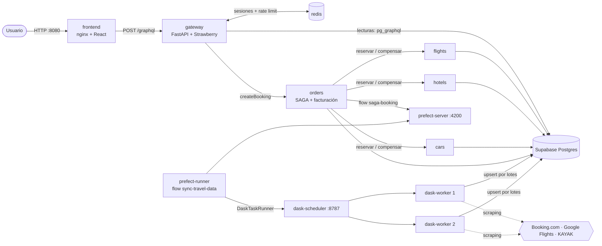

| Contenedor | Tecnología | Responsabilidad |
|---|---|---|
| `frontend` | React + Vite + Apollo Client, servido con nginx | UI; proxy de `/graphql` (el gateway no publica puerto) |
| `gateway` | FastAPI + Strawberry GraphQL | API única: lecturas a `pg_graphql`, escrituras a `orders`, sesiones, rate limiting |
| `flights`, `hotels`, `cars` | FastAPI | Participantes de la SAGA: reservar (`POST`) y compensar (`DELETE`), idempotentes |
| `orders` | FastAPI + `prefect-client` | Orquestador SAGA y facturación (pago); cada saga es un flow run de Prefect |
| `redis` | Redis 7 | Sesiones server-side y contadores de rate limiting |
| `prefect-server` | Prefect 3.8 | UI y API de orquestación/observabilidad (ingesta y SAGA) |
| `prefect-runner` | Prefect | Registra los deployments de ingesta y los ejecuta sobre Dask |
| `dask-scheduler`, `dask-worker` ×2 | Dask distributed | Cómputo distribuido del scraping/limpieza/upsert (Chromium headless por worker) |
| `migrate` | Python (one-shot) | Aplica las migraciones SQL al esquema aislado `wandersync` |

- **Un solo comando:** `docker compose up --build`; dependencias declaradas con `condition: service_healthy` y
  `service_completed_successfully` (las migraciones terminan antes de que arranque cualquier servicio que use la BD).
- **Aislamiento:** contenedores no root, solo se publican `8080`, `4200` y `8787`; los servicios internos se autentican
  entre sí con un token interno. Cada contenedor tiene `mem_limit` (≈ 1 GB en reposo para todo el stack).
- **Imágenes reproducibles:** `python:3.12-slim`, `requirements.txt` con hashes (`pip install --require-hashes`); una
  sola imagen para Prefect, el scheduler y los workers de Dask (versiones idénticas, requisito de Dask).

Detalle completo, decisiones y alternativas descartadas: [`docs/arquitectura.md`](docs/arquitectura.md).

## 2. API Gateway GraphQL y persistencia (15%)

El frontend **solo** habla con `POST /graphql`. Las lecturas se resuelven en Postgres con **`pg_graphql`** de Supabase y
las escrituras (`createBooking`) van a `orders`; el gateway no conoce a vuelos, hoteles ni autos.

**Sin over-fetching de extremo a extremo:** los resolvers leen los campos seleccionados por el cliente y construyen la
consulta a `graphql.resolve(...)` pidiendo **solo esas columnas**, con filtros, orden y paginación por cursor resueltos en
la base de datos. `searchPackages` consolida vuelos + hoteles + autos en **una sola** ida a la BD y omite las colecciones
que no se pidieron. El panel *Consulta GraphQL enviada* del frontend muestra exactamente lo que se pidió.

| Búsqueda BOG → MDE | Resultados con la fuente de cada dato |
|---|---|
| 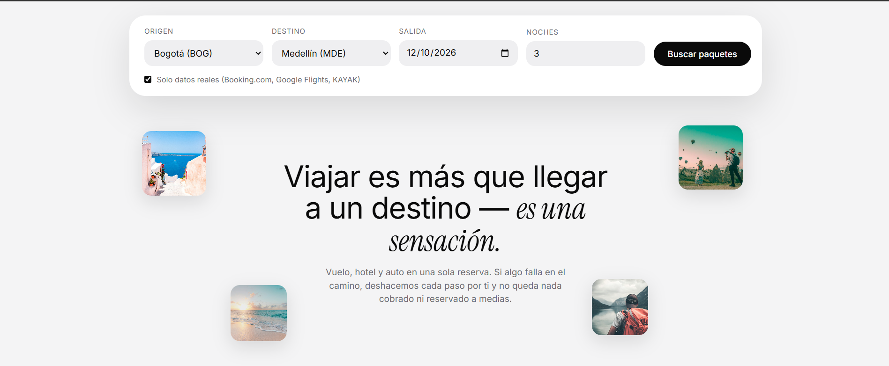 | 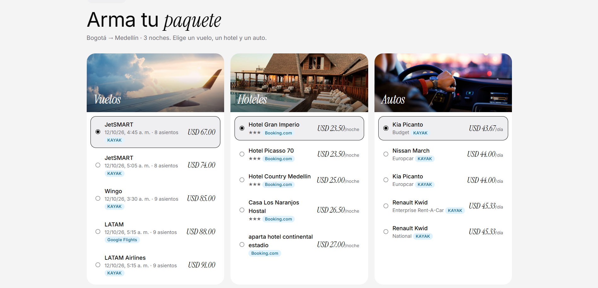 |

GraphiQL con paginación por cursor (`first`, `endCursor`, `hasNextPage`):

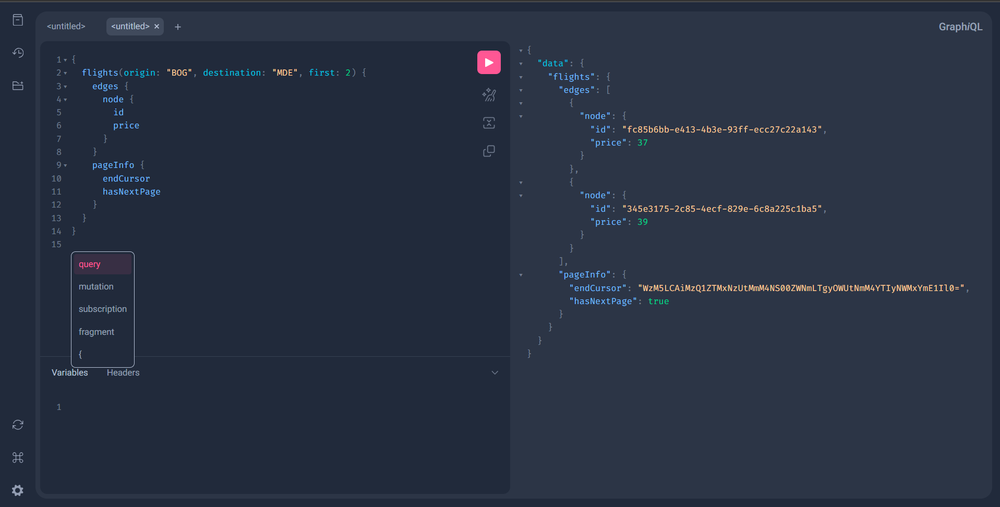

- **Mutaciones:** `register`, `login`, `logout`, `createBooking` (resultados tipados con `union`: éxito | `ApiError`).
- **Seguridad de la API:** variables GraphQL (nunca interpolación), validación de IATA y fechas, límites de profundidad
  (8), alias (15) y tokens (2500), errores internos enmascarados; las consultas por `GET` están deshabilitadas.
- **Persistencia aislada:** las tablas viven en el esquema `wandersync` con RLS; `pg_graphql` solo ve 5 vistas de solo
  lectura (`ws_*`) a través de un rol lector mínimo, y el filtro `user_id = <sesión>` de las órdenes lo pone el servidor.
- **Fechas locales:** la búsqueda por día usa la zona horaria del aeropuerto de origen (un vuelo de las 21:30 en Bogotá
  pertenece a ese día aunque en UTC ya sea el siguiente).

## 3. Patrón SAGA y consistencia transaccional (25%)

SAGA por **orquestación** en el servicio `orders`: `FLIGHT → HOTEL → CAR → PAYMENT`. Si un paso falla, se compensan los
pasos ya hechos **en orden inverso**, automáticamente; cada paso queda en `saga_log` y el frontend muestra la línea de
tiempo en vivo.

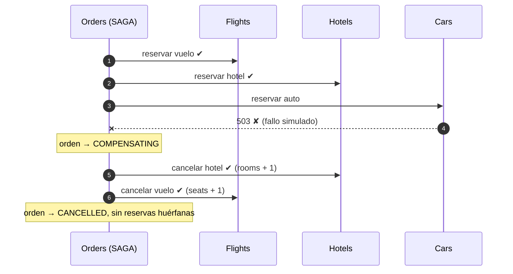

Escenarios que se pueden simular desde la UI (*Simular fallo*) y que verifica `scripts/e2e.py` contra la BD real:

| Escenario | Resultado |
|---|---|
| Ninguno (camino feliz) | `CONFIRMED`: 3 reservas confirmadas + pago capturado |
| Falla el vuelo / el hotel / el auto | `CANCELLED`: se cancelan los pasos previos; inventario restituido |
| Pago rechazado | `CANCELLED`: se cancelan auto, hotel y vuelo |
| Timeout del servicio de autos (fallo ambiguo) | `CANCELLED`: también se compensa el auto; la reserva que llega tarde se rechaza |
| El auto falla y la compensación del hotel falla 2 veces | `CANCELLED`: la compensación se reintenta sola y funciona al 3.er intento |
| `orders` se reinicia a mitad de la saga | El *reaper* revierte la orden huérfana sin intervención manual |

Garantías: reservas idempotentes por `order_id`, `DELETE` tolerante, *tombstone* contra reservas tardías, descuento de
inventario atómico, reintentos con backoff y reaper cada 15 s. Secuencias completas (feliz y con compensación) y máquina
de estados en [`docs/arquitectura.md` §4](docs/arquitectura.md#4-patrón-saga-orquestación).


### La SAGA en Prefect

Cada reserva se ejecuta como un **flow run de Prefect** (`saga-booking`, llamado `order-<id>` como en la UI): un task por
paso (`reserve-flight`, `reserve-hotel`, `reserve-car`, `capture-payment`) y por compensación (`cancel-*`,
`refund-payment`). Las compensaciones usan la **política de reintentos de Prefect** (`retries=4`, backoff 0.5/1/2/4 s) y
el estado final del flow refleja el de la orden: `Confirmed`, `Compensated` o `CompensationFailed`; si `orders` se cae a
mitad, el flow queda `Crashed`. Si Prefect no está disponible, la saga corre igual sin él.

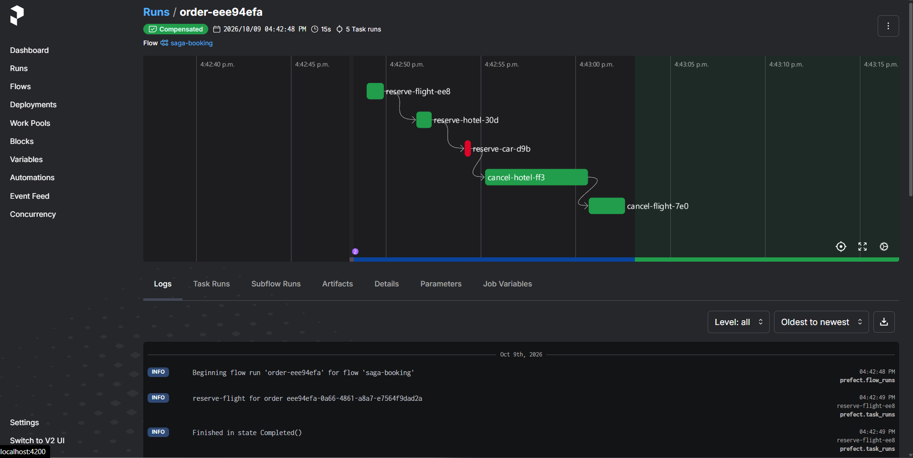

Evidencia por escenario (estados y `run_count` leídos de la API de Prefect): [`prefect-saga.txt`](docs/evidencias/prefect-saga.txt).

## 4. Computación distribuida y observabilidad: Dask + Prefect (25%)

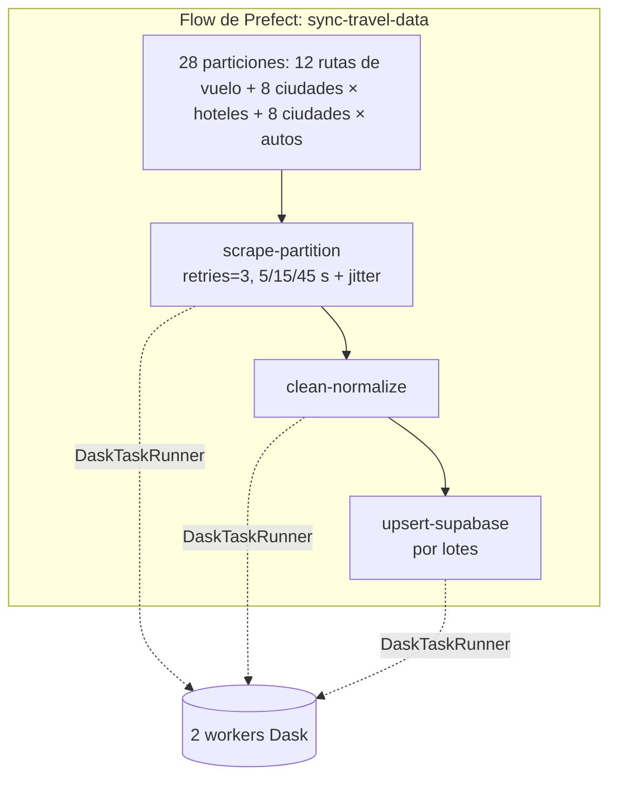

**Fuentes reales** renderizadas con [Scrapling](https://github.com/D4Vinci/Scrapling) (Chromium headless): hoteles de
**Booking.com**, vuelos de **Google Flights** y **KAYAK**, autos de **KAYAK**. Si una fuente bloquea, Prefect reintenta
y solo tras el último intento la partición cae a la fuente sintética (`source = 'mock'`). El upsert actualiza precios
pero nunca pisa el inventario que las reservas ya descontaron.

### Prefect (ingesta)

Dos deployments: `scheduled-sync` (cada 30 min, datos reales) y `demo-with-retries` (cada scrape falla 2 veces a
propósito para evidenciar los reintentos).

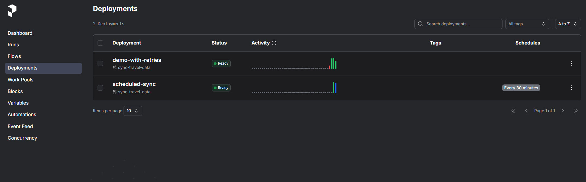

Reintentos en acción: los 28 `scrape-partition` fallan 2 veces (fallo de red inyectado) y Prefect los reintenta a los
5 s y 15 s; todos terminan en el 3.er intento.

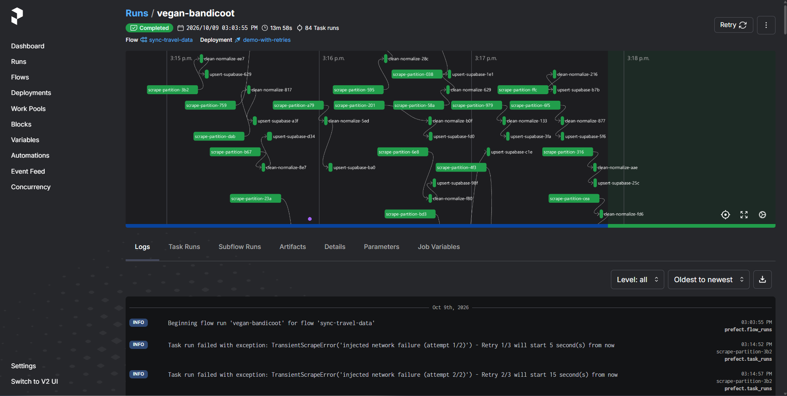

Ingesta real: cada partición registra de dónde salieron los datos (p. ej. `scraped 142 flights for BOG-CTG from
google_flights+kayak`).

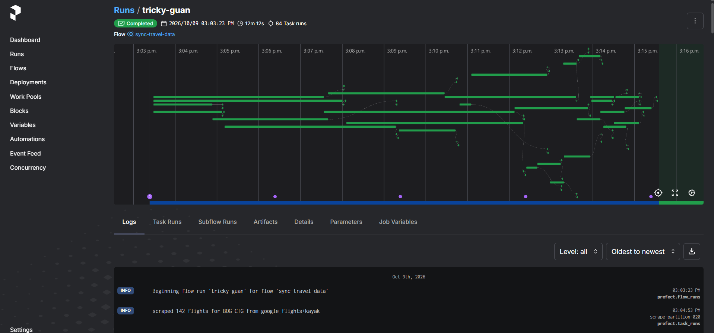

Ejecución programada (`auto-scheduled`) del deployment `scheduled-sync`:

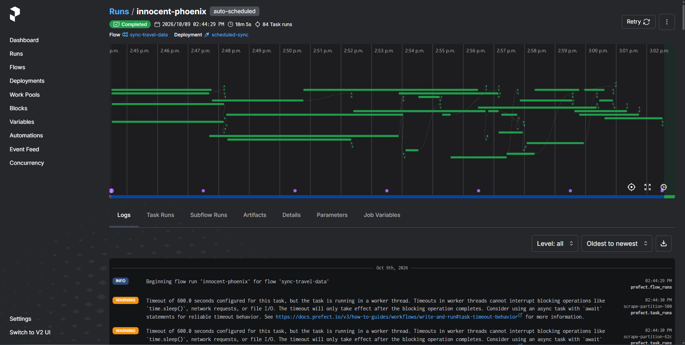

### Dask (ejecución distribuida)

Task stream de los 2 workers (4 hilos) procesando las particiones en paralelo, progreso por etapa (`scrape → clean →
upsert`) y 0 errores:

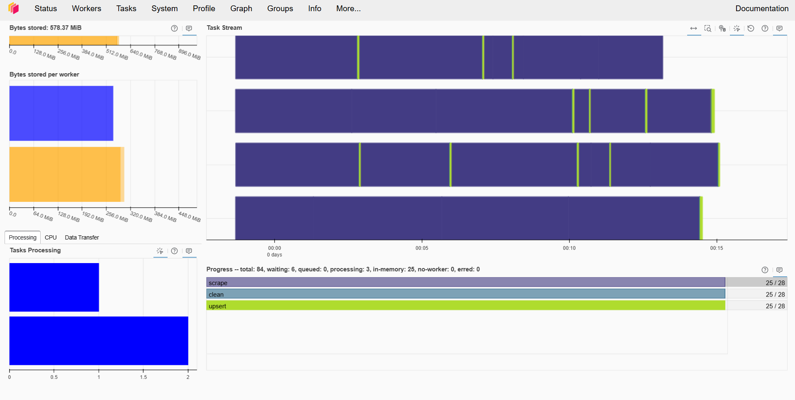

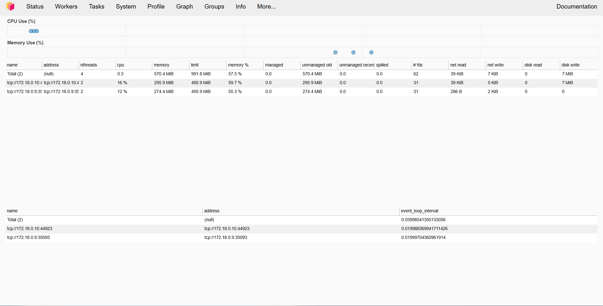

## 5. Ciberseguridad y resiliencia (20%)

| Requisito | Implementación | Evidencia |
|---|---|---|
| **Session Fixation** | Sesión server-side en Redis; `login`/`register` **generan un ID nuevo e invalidan el anterior**; cookie firmada (HMAC), `HttpOnly`, `SameSite=Lax` | `e2e.py`: `session id REGENERATED on login`, `pre-login session id no longer authenticates` |
| **Hash de contraseñas** | **Argon2id** (`m=19 MiB, t=3, p=1`), rehash automático, verificación en tiempo constante ante usuarios inexistentes | `test_argon2id_hash_and_verify` |
| **Rate limiting** | Ventana deslizante atómica (Lua en Redis): `login` 5/min por cuenta+IP, `register` 5/10 min, `createBooking` (checkout y pago) 5/min por usuario y 20/min por IP → **HTTP 429 + `Retry-After`** | `e2e.py`: `[200, 200, 200, 200, 200, 429, 429, 429]`; la UI muestra «Demasiados intentos» |
| **Supply chain** | `pip-audit` sobre los 7 `requirements.txt` con hashes + `npm audit` del frontend: **0 vulnerabilidades** | [`pip-audit.txt`](docs/seguridad/pip-audit.txt), [`npm-audit.txt`](docs/seguridad/npm-audit.txt) |
| Otros | CSP y cabeceras de seguridad en nginx, verificación de `Origin`, gateway sin puerto público, token interno entre servicios, RLS + rol lector mínimo, límites de complejidad GraphQL | [`docs/seguridad/README.md`](docs/seguridad/README.md) |

**Resiliencia:** compensaciones idempotentes con reintentos, reaper de sagas huérfanas (probado reiniciando `orders` a
mitad de una saga), reintentos de Prefect en la ingesta y en la SAGA, y la SAGA sigue funcionando si Prefect se cae.

## Demostración en vivo

Guion completo en [`docs/demo.md`](docs/demo.md):

- **(a) Prefect monitoreando los flujos:** deployments, run `demo-with-retries` con reintentos, runs de `saga-booking`.
- **(b) Tareas distribuidas en Dask:** dashboard `:8787` durante una ingesta.
- **(c) GraphQL desde el frontend:** búsqueda con el panel *Consulta GraphQL enviada* y GraphiQL.
- **(d) Fallo transaccional y compensaciones SAGA:** reservas con fallo simulado, línea de tiempo en la UI y el mismo
  flow run en Prefect.

## Verificación

```bash
pip install -r requirements-dev.txt
make test    # 9 (SAGA) + 14 (gateway) + 9 (ingesta) pruebas unitarias
make e2e     # 25 comprobaciones contra el stack real (sesiones, SAGA + Prefect, compensaciones, reserva tardía, 429)
make audit   # pip-audit por servicio + npm audit  ->  docs/seguridad/
python scripts/e2e_recovery.py   # reinicia el orquestador a mitad de una saga y verifica la reversión (~2.5 min)
```

Resultados guardados en [`docs/evidencias/`](docs/evidencias): [`e2e.txt`](docs/evidencias/e2e.txt) (25/25),
[`e2e_recovery.txt`](docs/evidencias/e2e_recovery.txt), [`prefect-saga.txt`](docs/evidencias/prefect-saga.txt) y
[`prefect-retries.txt`](docs/evidencias/prefect-retries.txt).

## Estructura del repositorio

```
services/{gateway,flights,hotels,cars,orders}/  FastAPI (+Strawberry en gateway, +Prefect en orders), Dockerfile y requirements con hashes
ingestion/                                      Flow de Prefect, scrapers, limpieza y upsert (imagen usada por Prefect y Dask)
frontend/                                       React + Vite + Apollo Client servido con nginx
db/                                             Migraciones SQL y runner
libs/common/                                    Utilidades compartidas (pool DB, token interno, inyección de fallos)
scripts/                                        e2e.py, e2e_recovery.py, audit.sh
docs/                                           Arquitectura, demo, seguridad, evidencias y capturas
```

Documentación:

- [Documento técnico de arquitectura](docs/arquitectura.md): diagramas, secuencias SAGA (feliz, compensación y en
  Prefect), ingesta, decisiones y alternativas descartadas.
- [Guion de la demostración en vivo](docs/demo.md)
- [Ciberseguridad y auditoría de dependencias](docs/seguridad/README.md)

## Limitaciones conocidas

- **Scraping real:** los sitios pueden bloquear o cambiar su markup; en ese caso Prefect reintenta y `SCRAPER_MODE=auto`
  cae a datos sintéticos (`source = 'mock'`), que el buscador oculta con *Solo datos reales*. Los vuelos reales cubren
  los días `SCRAPE_FLIGHT_DAYS` (por defecto hoy+3 y hoy+7). Los sitios no publican cupos: se usa un inventario nominal.
- **BD compartida:** la base de Supabase ya tenía tablas de otra aplicación en `public`; WanderSync vive en el esquema
  `wandersync` y solo publica cinco vistas de solo lectura `ws_*`.
- **Simulación de fallos** (`ALLOW_FAILURE_SIMULATION=true`) es para la demo; desactivarla en producción.
