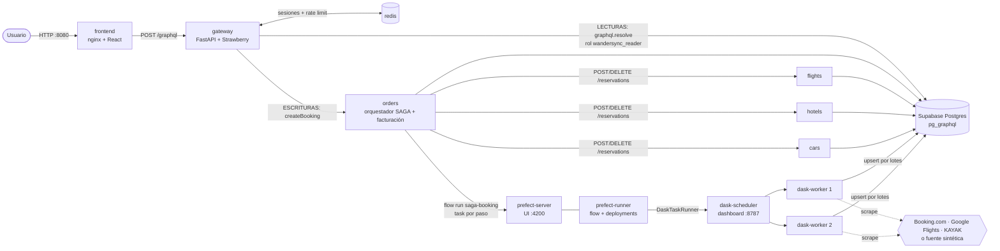
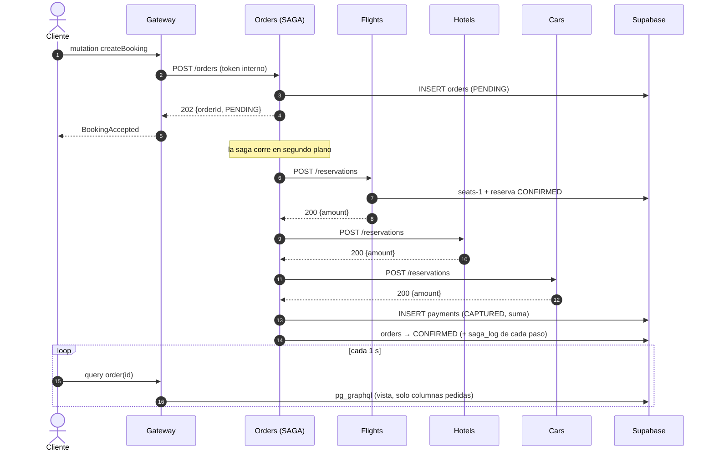
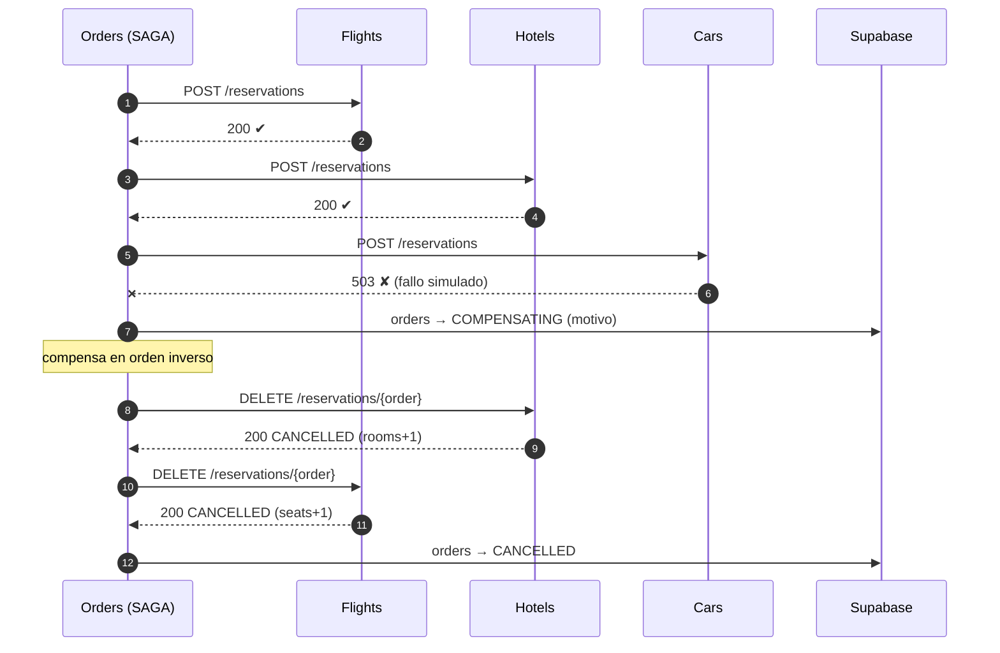
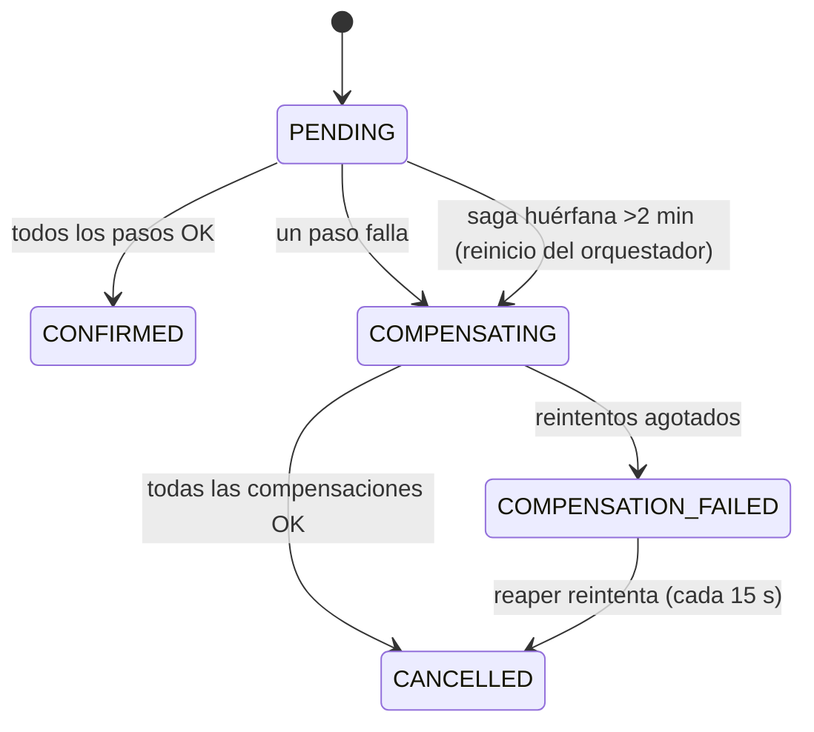
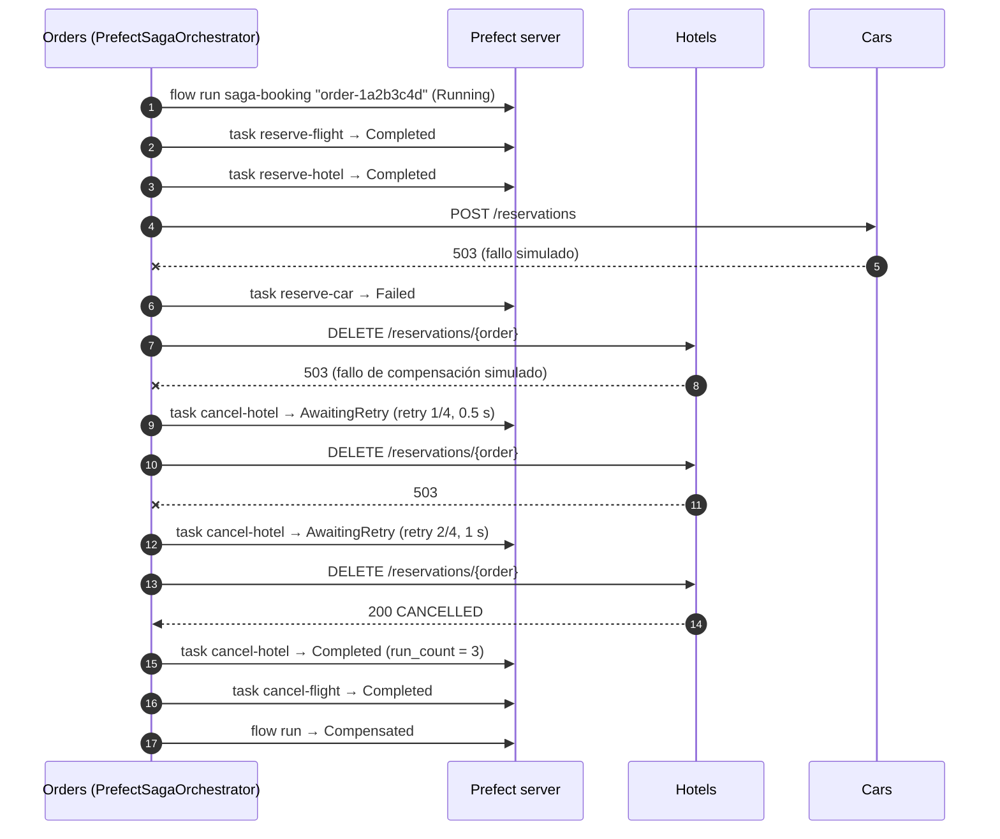
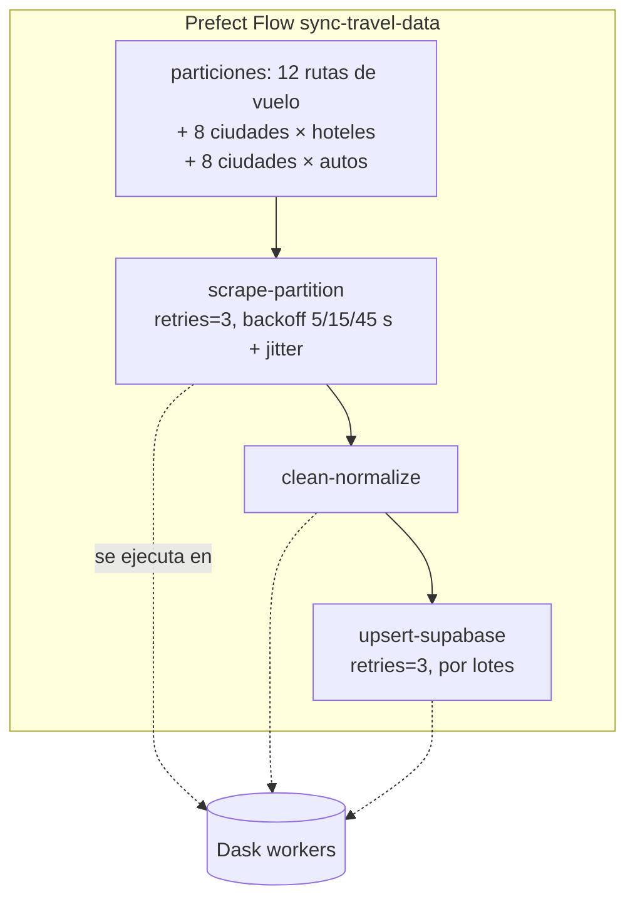

# Documento técnico de arquitectura: WanderSync Travel Solutions

## 1. Problema y objetivos

La plataforma anterior sufría **reservas huérfanas**: el pago y el vuelo se confirmaban pero el hotel o el auto fallaba,
sin reversión automática. Además, la sincronización masiva de tarifas bloqueaba la capa de persistencia.
El rediseño ataca ambos problemas con:

| Problema | Solución |
|---|---|
| Inconsistencia transaccional | **SAGA por orquestación**, ejecutada como **flow de Prefect** (un task por paso y por compensación), con compensaciones idempotentes, reintentos y recuperación automática |
| Ingesta bloqueante | **Dask** (workers paralelos) coordinado por **Prefect** (retries + observabilidad), desacoplado del tráfico de usuarios |
| Over-fetching / acoplamiento del frontend | **API Gateway GraphQL** único; lecturas delegadas a `pg_graphql` con proyección de columnas |
| Seguridad | Argon2id, sesiones server-side con regeneración de ID, rate limiting, auditoría de dependencias |

## 2. Vista de contenedores



Servicios en `docker-compose.yml`: `frontend`, `gateway`, `flights`, `hotels`, `cars`, `orders`, `redis`,
`prefect-server`, `prefect-runner`, `dask-scheduler`, `dask-worker` (×2) y `migrate` (one-shot). Un único
`prefect-server` observa los **dos** procesos que el enunciado pide orquestar: la ingesta (`sync-travel-data`) y la SAGA
(`saga-booking`). El gateway **no publica
puerto**: solo nginx lo alcanza, de modo que `X-Real-IP` es confiable para el rate limiting.

## 3. API Gateway GraphQL

**Regla:** el frontend solo habla con `POST /graphql`.

### 3.1 Lecturas: cero over-fetching de extremo a extremo

Los resolvers de `flights`, `hotels`, `cars`, `searchPackages`, `order` y `myOrders` leen `info.selected_fields`
(Strawberry) y construyen una query hacia `graphql.resolve(...)` de **pg_graphql** pidiendo **solo las columnas
solicitadas**, con filtros, orden y paginación por cursor (`first/after`, `pageInfo`) resueltos en Postgres.

```
Cliente:  { searchPackages(...) { flights { edges { node { id price } } } } }
   ↓ (se omiten hoteles y autos: no fueron pedidos)
Postgres: query($ff,$fo,$fn,$fa){ flights: ws_catalog_flightsCollection(filter:$ff, orderBy:$fo, first:$fn, after:$fa)
          { edges { node { id price } } } }
```

- `searchPackages` consolida vuelos + hoteles + autos en **una sola** ida a la base de datos.
- Los valores del usuario viajan como **variables GraphQL**, nunca interpolados (sin inyección); los códigos IATA y fechas
  se validan antes.
- Verificado en `services/gateway/tests/test_gateway.py` (la query enviada contiene exactamente las columnas pedidas) y
  en los logs del gateway (`pg_graphql query: ...`).

### 3.2 Aislamiento de lectura

`pg_graphql` de Supabase solo expone el esquema `public`. Las tablas reales viven en el esquema `wandersync` (no expuesto,
con RLS activado) y se publican **únicamente** cinco vistas de solo lectura: `ws_catalog_flights`, `ws_catalog_hotels`,
`ws_catalog_cars`, `ws_order_summaries`, `ws_order_saga_steps`.

- Las consultas se ejecutan tras `SET LOCAL ROLE wandersync_reader`, un rol con `SELECT` solo sobre esas vistas.
- Se revocó todo a `anon`/`authenticated` (Supabase concede `ALL` por defecto en `public`).
- Para órdenes, el filtro `user_id = <sesión>` lo **inyecta el servidor**; el cliente no puede consultar órdenes ajenas.
- `users`, `payments` y `saga_log` no son alcanzables por GraphQL.

### 3.3 Escrituras y esquema

Mutaciones: `register`, `login`, `logout`, `createBooking` (resultados tipados con `union`: éxito | `ApiError`).
`createBooking` llama únicamente a `orders`: el gateway no conoce a vuelos, hoteles ni autos, así que el acoplamiento
queda oculto tras el orquestador. Protecciones: profundidad máx. 8, 15 alias, 2500 tokens, errores internos
enmascarados (los mensajes de validación deliberados se conservan), introspección desactivable
(`GRAPHQL_INTROSPECTION=false`).

### 3.4 Trazabilidad de los datos en la API

- `Flight`, `Hotel` y `Car` exponen `source` (`booking.com`, `google_flights`, `kayak` o `mock`) y `fetchedAt`.
- `searchPackages(..., realOnly: true)` excluye la fuente sintética de respaldo (filtro `source <> 'mock'` en Postgres).
- `dataSources { kind source items lastFetchedAt minPrice }` resume lo que la ingesta ha cargado, por tipo y fuente
  (vista `ws_catalog_sources`, migración `005_catalog_sources.sql`).
- El frontend usa esto en la portada: **paquetes destacados** (BOG → CTG/MDE/MIA/MAD, la opción real más barata,
  calculados en una sola petición con alias), la sección **Datos en vivo** (registros, última actualización y precio
  mínimo por fuente, con enlaces a Prefect y Dask) y una etiqueta de fuente en cada resultado.

## 4. Patrón SAGA (orquestación)

Elegí **orquestación** (no coreografía): el flujo `vuelo → hotel → auto → pago` es lineal, con un único dueño del
estado (`orders`), por lo que es más fácil de auditar, depurar y demostrar; el estado y cada paso quedan en `saga_log`.
No requiere un broker adicional (ahorra RAM). Costo asumido: `orders` es un punto de coordinación (mitigado con
persistencia + recuperación al reiniciar). Cada saga se ejecuta además como un **flow run de Prefect** (§4.5), de modo que
la transacción distribuida se monitorea en la misma UI que la ingesta.

### 4.1 Camino feliz



### 4.2 Fallo del auto → compensación automática



### 4.3 Máquina de estados de la orden



### 4.4 Garantías de diseño

| Riesgo | Mecanismo |
|---|---|
| Reintentos duplican efectos | Reservas **idempotentes** por `order_id` (`UNIQUE`); pedido idempotente por `(user_id, idempotency_key)` |
| Compensación sobre algo que nunca se hizo | `DELETE` tolerante: devuelve `NOT_FOUND` sin error |
| Reserva que llega **después** de su compensación (timeout: la petición seguía viva en el participante) | La compensación deja una fila *tombstone* `CANCELLED` para la orden; la reserva tardía choca con ella (`UNIQUE(order_id)`) y se rechaza con 409, revirtiendo el descuento de inventario en la misma transacción |
| Timeout / 5xx: ¿se reservó o no? | Fallo **ambiguo** → se compensa también el paso que falló (idempotente) |
| Compensación falla | Política de reintentos de Prefect en cada task `cancel-*` (`retries=4`, esperas 0.5/1/2/4 s) y luego estado visible `COMPENSATION_FAILED` |
| Compensación agotada | **Reaper** cada 15 s reintenta la reversión de órdenes en `COMPENSATING`/`COMPENSATION_FAILED`, sin intervención manual |
| Caída del orquestador a mitad | El reaper detecta órdenes `PENDING` sin avance por más de 2 min que ninguna instancia está ejecutando (p. ej. tras un reinicio) y las revierte (aborto seguro). Su flow run queda `Crashed` en Prefect: lo marca Prefect al recibir la señal de terminación y, si el proceso muere sin avisar (`kill -9`), lo cierra el reaper |
| Prefect caído | La saga no depende de Prefect para ejecutarse: si `prefect-server` no responde al iniciar la reserva, el mismo orquestador corre sin él (verificado con el servidor detenido) |
| Sobreventa | `UPDATE ... SET seats = seats - n WHERE seats >= n` atómico dentro de la transacción de la reserva |
| Pago | Último paso; si falla se compensan los tres anteriores. `refundPayment` reversa un pago capturado |

Escenarios simulables desde la UI/API (`simulateFailure`): `FLIGHT`, `HOTEL`, `CAR`, `PAYMENT`, `CAR_TIMEOUT` (fallo
ambiguo) y `CAR_FLAKY_COMPENSATION` (la compensación del hotel falla 2 veces para evidenciar los reintentos).

### 4.5 La SAGA orquestada con Prefect

El enunciado pide Prefect «tanto en la ingesta como para la orquestación de SAGA». `orders` usa
`PrefectSagaOrchestrator` (`services/orders/app/prefect_saga.py`), que hereda del orquestador y solo cambia **dónde**
corre cada paso:

| SAGA | Prefect |
|---|---|
| Una reserva (orden) | Flow run de `saga-booking`, llamado `order-<id>` (los mismos 8 caracteres que muestra el frontend) |
| Paso hacia adelante | Task `reserve-flight`, `reserve-hotel`, `reserve-car`, `capture-payment` (sin reintentos: si falla, se compensa) |
| Compensación | Task `cancel-car`, `cancel-hotel`, `cancel-flight`, `refund-payment` con **`retries=4`** y backoff exponencial |
| Orden `CONFIRMED` | Estado final `Confirmed` |
| Orden `CANCELLED` | Estado final `Compensated` |
| Orden `COMPENSATION_FAILED` | Estado final `CompensationFailed` (el reaper la sigue reintentando) |
| Orquestador caído a mitad | El reaper revierte la orden; el flow run queda `Crashed` (Prefect o, si el proceso murió sin avisar, el reaper) |



- El flow corre **dentro** de `orders` (cliente `prefect-client`, mismo `prefect-server` que la ingesta): no añade
  latencia de colas ni workers, y la reserva sigue siendo asíncrona (`202` + polling).
- La traza de negocio (`saga_log`, la que ve el usuario en la línea de tiempo) y la de Prefect se escriben desde el mismo
  task, así que coinciden intento por intento.
- Cada task espera al anterior (`wait_for`, con `allow_failure` para que la compensación corra tras un paso fallido), de
  modo que el grafo de Prefect muestra la cadena real: `reserve-flight → reserve-hotel → reserve-car ✘ → cancel-hotel →
  cancel-flight`.
- Verificado en `scripts/e2e.py`: el camino feliz es un flow `Confirmed` con un task por paso y, con
  `CAR_FLAKY_COMPENSATION`, `cancel-hotel` termina `Completed` con `run_count = 3`; `scripts/e2e_recovery.py`
  comprueba que el flow interrumpido queda `Crashed`.

## 5. Ingesta distribuida: Dask + Prefect



- El `DaskTaskRunner(address="tcp://dask-scheduler:8786")` envía cada task a los workers; la UI de Prefect muestra estado
  y reintentos y el dashboard de Dask (`:8787`) muestra la ejecución en paralelo. Una sola imagen (`ingestion/Dockerfile`)
  sirve a Prefect, al scheduler y a los workers, garantizando versiones idénticas.
- **Deployments:** `scheduled-sync` (cada 30 min) y `demo-with-retries` (cada scrape falla 2 veces antes de funcionar;
  ideal para la demo). Al arrancar se ejecuta una primera ingesta.
- **Reintentos:** política explícita en `scrape` y `upsert`. Además `mode=auto` cae a datos sintéticos únicamente tras
  agotar todos los reintentos contra la fuente real.
- **No pisar inventario:** el `UPSERT` actualiza precios/metadata pero **nunca** `seats_available`/`rooms_available`/
  `units_available`, para no resetear el stock que las reservas ya descontaron (verificado por test).
- **Cuello de botella de persistencia:** `executemany` por partición y conexión corta por task; el catálogo se lee por vistas.

### Fuente de datos (honestidad)

Las tres categorías usan **fuentes reales**, todas renderizadas con el `DynamicFetcher` de
[Scrapling](https://github.com/D4Vinci/Scrapling) (Chromium headless vía Playwright, helper `scrapers.render`):

| Datos | Fuente (`source`) | Qué se lee | Por partición |
|---|---|---|---|
| Hoteles | Booking.com (`booking.com`) | tarjetas `data-testid="property-card"` | 1 ciudad |
| Vuelos | Google Flights (`google_flights`) | el `aria-label` de cada resultado: precio, aerolínea, escalas, horas locales | 1 ruta × días `SCRAPE_FLIGHT_DAYS` (por defecto +3 y +7) |
| Vuelos | KAYAK (`kayak`) | texto visible de cada `Result item` (se descartan anuncios) | igual que Google Flights |
| Autos | KAYAK (`kayak`) | `alt` de las imágenes ("Vehicle type: Mini - Renault Kwid…", "Car agency: Alamo") y precio total ÷ días | 1 ciudad (aeropuerto) |

Por qué un navegador: un cliente HTTP simple (`httpx`, e incluso el `Fetcher` de Scrapling con huella TLS de Chrome)
recibe **HTTP 202** de Booking (reto anti-bot de AWS WAF que exige ejecutar JavaScript), y Google Flights/KAYAK
construyen los resultados con JavaScript. Detalles:

- Se parsea contenido semántico (aria-labels, textos alternativos, texto visible) y no las clases CSS ofuscadas, que
  cambian con cada despliegue de esos sitios.
- Las horas publicadas son locales de cada aeropuerto y se guardan como `timestamptz` (`destinations.AIRPORT_TZ`).
- Un solo navegador a la vez por worker (semáforo) para no exceder el `mem_limit` de 1 GB del contenedor.
- `disable_resources` se deja **apagado**: bloquear recursos impide que el reto anti-bot se resuelva (verificado).
- Estrellas de Booking: se leen del `aria-label` oficial ("Property rating: 4 out of 5"); cualquier valor fuera de 1-5
  se descarta (la BD lo exige con un `CHECK`).
- Vuelos: si una de las dos fuentes falla, basta con la otra. Si una fuente bloquea o cambia su markup, el task falla
  con `ScrapeBlockedError`, Prefect reintenta y en `mode=auto` el flow cae a la fuente sintética determinista
  (`source='mock'`) solo tras el último intento. Para forzar un modo: `SCRAPER_MODE=mock|real|auto`.
- Los sitios no publican cupos: los registros reales usan un inventario nominal (9 asientos, 5 habitaciones, 5 autos)
  que las reservas descuentan y el `UPSERT` no vuelve a pisar.

## 6. Ciberseguridad por diseño

Detalle y evidencias en [`seguridad/README.md`](seguridad/README.md).

| Requisito | Implementación | Evidencia |
|---|---|---|
| Session Fixation | Sesión server-side en Redis; `login`/`register` **crean un ID nuevo e invalidan el previo**; cookie firmada (HMAC), `HttpOnly`, `SameSite=Lax`, TTL deslizante | `e2e.py` y `test_gateway.py` |
| Hash de contraseñas | **Argon2id** (`m=19 MiB, t=3, p=1`), rehash automático si cambian parámetros, verificación de tiempo constante ante usuarios inexistentes, ejecutado en hilo | `test_argon2id_hash_and_verify` |
| Rate limiting | Ventana deslizante atómica (Lua/Redis): `login` 5/min por cuenta+IP y 20/min por IP; `register` 5/10 min; `createBooking` (checkout/pago) 5/min por usuario y 20/min por IP. Responde **HTTP 429 + `Retry-After`** | `e2e.py` (`[200×5, 429×3]`) |
| Supply chain | `pip-audit` (requirements con hashes, `--require-hashes`) por cada servicio + `npm audit`; **0 vulnerabilidades** | `docs/seguridad/pip-audit.txt`, `npm-audit.txt` |
| Otros | Contenedores no root, sin puertos internos publicados, token interno entre servicios, RLS + rol lector mínimo, CSP y cabeceras en nginx, límites de complejidad GraphQL, verificación de `Origin`, variables GraphQL (sin inyección) | |

## 7. Recursos

Medido con `docker stats` en reposo: el stack completo ocupa **≈ 1.0 GB** (gateway 81 MB, workers Dask 170 MB c/u,
Prefect server 214 MB, servicios de dominio ~41 MB c/u, `orders` ~90 MB con el cliente de Prefect, redis 7 MB). Cada contenedor tiene `mem_limit` (suma de límites
≈ 3.6 GB). Prefect usa SQLite, Redis está acotado a 48 MB y las imágenes son `python:3.12-slim` de un solo proceso.
Docker Desktop con 4-6 GB es suficiente. Con el scraping real, cada worker
Dask abre un Chromium headless mientras procesa un hotel, por lo que su límite subió a 1 GB (suma de límites ≈ 4.3 GB) y la
imagen de ingesta incluye Chromium. `orders` pasó de 192 MB a 384 MB de límite al incorporar el cliente de Prefect.

## 8. Decisiones y alternativas descartadas

| Decisión | Alternativa | Por qué |
|---|---|---|
| Orquestación SAGA | Coreografía con broker | Flujo lineal; auditabilidad; un contenedor menos |
| SAGA como flow de Prefect **dentro** de `orders` | Deployment de Prefect ejecutado por un worker | Sin cola ni latencia extra en el checkout; la reserva no depende de un worker disponible y, si Prefect cae, la saga sigue sin él |
| Lecturas por `pg_graphql` | Servicios REST + recorte en el gateway | Evita over-fetching real (BD→cliente) e integra la BD nativamente |
| Esquema `wandersync` + vistas `ws_*` | Tablas en `public` | La BD ya tenía datos de otra app (`users`, `orders`…); aislamiento total |
| Sesiones Redis | JWT sin estado | Permite regenerar/invalidar el ID (Session Fixation) de forma demostrable |
| Supabase cloud | Postgres/Hasura local | Requerido por el proyecto; se documenta la dependencia de red |
| Modo transacción del pooler (6543) | Modo sesión | Muchos servicios sin agotar el pool; `prepare_threshold=None` |
